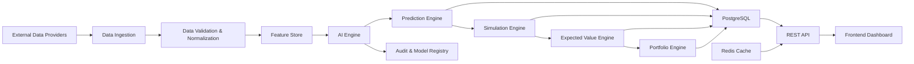

# LigaMX IA Analytics - Master Product Requirements Document

## 1. Purpose

This Product Requirements Document defines the functional and non-functional requirements for LigaMX IA Analytics. It captures user needs, success criteria, module decomposition, quality expectations, and release planning for the platform's Version 1.0 launch.

The document is authoritative for the product, engineering, AI, data, UX, and operations teams.

## 2. Product Vision

Build a professional-grade Liga MX football analytics platform that combines statistical modeling, machine learning, and betting market intelligence to identify positive Expected Value opportunities in a transparent, auditable, and production-ready way.

The platform empowers analysts and portfolio managers with predictive probabilities, scenario simulations, risk-managed betting recommendations, and governance controls.

## 3. Product Summary

LigaMX IA Analytics delivers:
- pre-match probability estimates and score distributions,
- Expected Goals and market edge analysis,
- portfolio and bankroll management using Kelly sizing,
- backtesting and model governance,
- secure REST APIs and professional dashboards.

It is designed for long-term evolution inside a Docker-based production environment with PostgreSQL, Redis, Celery, and modern frontend tooling.

## 4. Actors

| Actor | Role | Primary Goals |
|---|---|---|
| Analyst | Uses predictions and simulations | Evaluate markets and export insights |
| Portfolio Manager | Manages capital and positions | Place profitable bets, control risk |
| AI Model Lead | Develops models and feature pipelines | Track model performance and promote versions |
| Auditor | Verifies compliance and provenance | Review audit trails and prediction lineage |
| Admin | Operates the platform | Manage users, deployment, and data ingest |

## 5. User Stories

### 5.1 Prediction and Analytics

- As an Analyst, I want to view win/draw/loss probabilities for a Liga MX match so I can compare them with bookmaker odds.
- As an Analyst, I want to inspect score distribution and expected goals so I can understand model confidence and variance.
- As an Analyst, I want to simulate tactical scenarios and compare alternate predictions.

### 5.2 Portfolio Management

- As a Portfolio Manager, I want to define portfolio risk parameters so I can enforce drawdown and exposure limits.
- As a Portfolio Manager, I want to receive Kelly-based stake recommendations for qualified bets.
- As a Portfolio Manager, I want to settle bets and review realized PnL and ROI.

### 5.3 Governance and Compliance

- As an Auditor, I want to retrieve audit records for predictions and bets so I can verify decision provenance.
- As an AI Model Lead, I want to register and promote model versions with evaluation metrics.
- As an Admin, I want to manage user roles and access controls.

### 5.4 Backtesting

- As a Data Scientist, I want to run backtests across historical seasons using the production model.
- As a Data Scientist, I want to review calibration and ROI metrics from backtests.

## 6. Features

| Feature | Description | Notes |
|---|---|---|
| Match predictions | Calculate probabilities, expected goals, and score distributions | Uses Poisson/bivariate models |
| Market edge analysis | Compare model probabilities with bookmaker odds | Supports EV and edge metrics |
| Simulation engine | Run Monte Carlo and scenario simulations | Supports alternate lineups and conditions |
| Portfolio management | Manage capital, bets, exposure, and risk | Includes Kelly stake recommendations |
| Audit trail | Persist immutable prediction and portfolio actions | Supports compliance search |
| Model registry | Version model artifacts and evaluate metrics | Supports lifecycle promotion |
| Backtesting | Execute historical performance evaluation | Produces ROI, calibration, and risk reports |
| Dashboard UI | Visualize predictions, portfolios, and health | Role-based experience |
| REST API | Expose secure endpoints for all platform capabilities | OAuth2/JWT-based |

## 7. Modules

### 7.1 Prediction Module
- Prediction engine
- Score distribution generator
- Simulation service
- Model inference interface

### 7.2 Portfolio Module
- Portfolio manager
- Bet lifecycle manager
- Stake recommendation engine
- Risk control evaluator

### 7.3 Market Module
- Odds ingestion
- Market normalization
- Edge calculation
- Supported market mapping

### 7.4 Governance Module
- Model version registry
- Audit record service
- Dataset snapshot tracking
- Access control audit

### 7.5 Backtesting Module
- Historical run executor
- Performance aggregator
- Calibration reporting
- Comparison to baseline models

### 7.6 Interface Module
- FastAPI REST service
- Pydantic schema definitions
- Authentication and authorization
- Query and pagination helpers

### 7.7 Frontend Module
- Next.js pages
- Dashboard components
- Data tables and charts
- Forms and notifications

## 8. Functional Requirements

### 8.1 Prediction and Simulation
- FR-1: Provide win/draw/loss probabilities for Liga MX matches.
- FR-2: Provide expected goals for home and away teams.
- FR-3: Provide scoreline probability distributions using Poisson, bivariate Poisson, and Dixon-Coles.
- FR-4: Execute simulation runs with Monte Carlo or analytic distributions.
- FR-5: Include scenario inputs for lineup, injury, and context adjustments.

### 8.2 Market and EV
- FR-6: Normalize bookmaker odds to implied probabilities.
- FR-7: Compute edge and Expected Value for supported markets.
- FR-8: Flag candidate bets with positive EV above configurable thresholds.

### 8.3 Portfolio and Risk
- FR-9: Manage portfolio capital, current balance, and risk limits.
- FR-10: Calculate recommended stake using Kelly Criterion and fractional sizing.
- FR-11: Enforce maximum portfolio exposure and single-market concentration limits.
- FR-12: Record placed, rejected, and settled bets with realized PnL.

### 8.4 Governance and Audit
- FR-13: Persist immutable audit records for every prediction, simulation, and portfolio action.
- FR-14: Track model version metadata, dataset snapshot references, and release notes.
- FR-15: Support audit-based queries by entity type, action, user, and date range.

### 8.5 API and Integration
- FR-16: Expose secured REST API endpoints for all domain resources.
- FR-17: Authenticate with OAuth2 and issue JWT access tokens.
- FR-18: Support pagination, filtering, and sorting across list endpoints.
- FR-19: Provide OpenAPI documentation and schema examples.

### 8.6 UI and Reporting
- FR-20: Provide responsive dashboards for predictions, portfolios, models, and audit.
- FR-21: Provide role-based page access.
- FR-22: Display loading states, error states, and inline notifications.

## 9. Non-functional Requirements

### 9.1 Performance
- NFR-1: Prediction endpoints must return within 500 ms under normal load.
- NFR-2: Dashboard first-page render must return within 1 second.
- NFR-3: Backtesting jobs must be horizontally scalable and complete within a defined SLA for a season dataset.

### 9.2 Security
- NFR-4: Enforce TLS for all production traffic.
- NFR-5: JWT tokens must use secure signing keys and expiration.
- NFR-6: Enforce role-based access control at the API and application levels.
- NFR-7: Protect secrets using environment configuration and vault integration.

### 9.3 Availability
- NFR-8: Achieve 99.9% uptime for the primary API in production.
- NFR-9: Provide health checks for backend API, Redis, PostgreSQL, and Celery workers.
- NFR-10: Support graceful recovery from transient service failures.

### 9.4 Scalability
- NFR-11: Support horizontal scaling of API, worker, and frontend services.
- NFR-12: Allow addition of read replicas for reporting workloads.
- NFR-13: Support increased dataset volume and model artifact storage.

### 9.5 Accessibility
- NFR-14: Frontend must meet WCAG AA accessibility standards.
- NFR-15: Provide keyboard navigation, semantic markup, and screen reader support.

### 9.6 Maintainability
- NFR-16: Maintain a clear separation between domain, application, and infrastructure layers.
- NFR-17: Keep documentation aligned with implementation.
- NFR-18: Use CI to enforce linting, tests, and contract validation.

### 9.7 Observability
- NFR-19: Emit structured logs for requests, predictions, and task executions.
- NFR-20: Capture metrics for latency, error rates, and model performance.
- NFR-21: Retain audit logs for at least one year.

## 10. KPIs and Metrics

| Category | KPI | Metric |
|---|---|---|
| Prediction | Probability accuracy | Win/draw/loss hit rate |
| Prediction | Calibration | Brier score, log loss, ECE |
| Portfolio | ROI | Net return on tracked bets |
| Portfolio | Risk | Maximum drawdown, exposure % |
| Model | Drift | Model degradation vs. baseline |
| Operational | Reliability | API uptime, task success rate |
| Adoption | Usage | Active user sessions, predictions generated |

## 11. Security Requirements

- SR-1: Use OAuth2 and JWT for authentication and session management.
- SR-2: Encrypt sensitive data in transit and at rest where applicable.
- SR-3: Implement role-based access control for actions and resources.
- SR-4: Log authentication and authorization failures.
- SR-5: Validate all inbound request payloads.

## 12. Performance Requirements

- PR-1: Use Redis caching for high-read endpoints.
- PR-2: Use SQL indexes and query optimization for dashboard queries.
- PR-3: Instrument request latency and task duration.
- PR-4: Use Celery workers for compute-intensive operations.

## 13. Availability Requirements

- AR-1: Provide health endpoints for each service.
- AR-2: Use retry logic for transient database or cache failures.
- AR-3: Use container orchestration to restart failed services.
- AR-4: Document recovery procedures in operations runbooks.

## 14. Scalability Requirements

- SR-1: Keep backend services stateless.
- SR-2: Partition long-lived audit storage when needed.
- SR-3: Scale Redis and Celery independently from API.
- SR-4: Support future expansion to multiple leagues through modular design.

## 15. Accessibility Requirements

- AX-1: Provide descriptive labels on controls.
- AX-2: Ensure color contrast ratios meet AA.
- AX-3: Support keyboard-only navigation.
- AX-4: Provide alternative text for non-text content.

## 16. Future Versions

### 16.1 Version 1.1
- Add additional football leagues beyond Liga MX.
- Add automated odds ingestion from multiple providers.
- Add advanced correlation and market-impact analytics.

### 16.2 Version 1.2
- Add live in-play simulation and alerts.
- Add support for exposure across multiple portfolios.
- Add user-configurable model experiment dashboards.

### 16.3 Version 2.0
- Add multi-tenant support and enterprise governance.
- Add advanced reinvestment and optimization strategies.
- Add additional sport markets with modular pipelines.

## 17. Acceptance Criteria

- AC-1: Prediction endpoints return valid probability distributions and score distributions for scheduled matches.
- AC-2: Portfolio creation and bet placement enforce risk limits and calculate recommended stake.
- AC-3: Model registry captures version metadata and allows promotion to production.
- AC-4: Audit records are created for predictions, bets, and model promotions.
- AC-5: Frontend dashboards render key metrics and support filtering, sorting, and pagination.
- AC-6: API authentication and authorization enforce role-based restrictions.
- AC-7: CI validates linting, tests, and documentation alignment.

## 18. Traceability

- Use this PRD to map product requirements to domain model decisions in `02_DOMAIN_MODEL.md`.
- Use `03_BUSINESS_RULES.md` to validate rule enforcement.
- Use `04_AI_ENGINE.md` for modeling decisions and evaluation metrics.
- Use `05_DATABASE.md` for persistence strategy.
- Use `06_ARCHITECTURE.md` for service decomposition and integration.

## 19. References

- `00_PROJECT_CHARTER.md`
- `02_DOMAIN_MODEL.md`
- `03_BUSINESS_RULES.md`
- `04_AI_ENGINE.md`
- `05_DATABASE.md`
- `06_ARCHITECTURE.md`
- `07_API_SPEC.md`
- `08_UI_UX.md`
- `09_DEVELOPMENT_RULES.md`
- `10_ROADMAP.md`

# 20. System Context

## 20.1 Overview

LigaMX IA Analytics is designed as a modular, event-driven football analytics platform. The system ingests football and betting market data from multiple external providers, transforms it into standardized features, executes AI prediction models, evaluates betting opportunities, and exposes results through REST APIs and a modern web interface.

The architecture separates data ingestion, business logic, AI processing, persistence, and presentation into independent modules to maximize scalability, maintainability, and testability.

---

## 20.2 High-Level Data Flow

---

## 20.3 External Data Sources

The platform must support multiple external providers.

Examples include:

- SofaScore
- Opta
- Football-Data
- Odds APIs
- CSV imports
- Manual administrative data

Every provider must be abstracted through adapters to avoid coupling the business logic to a specific vendor.

---

## 20.4 Processing Pipeline

The complete processing pipeline consists of the following stages:

1. Data ingestion
2. Data validation
3. Data normalization
4. Feature computation
5. Feature storage
6. Model inference
7. Probability calculation
8. Match simulation
9. Expected Value calculation
10. Kelly stake calculation
11. Portfolio recommendation
12. Audit persistence
13. API publication
14. Dashboard visualization

Each stage must be independently testable.

---

## 20.5 Core Platform Components

The system is composed of the following logical components:

### Data Ingestion

Responsible for importing and validating football statistics, fixtures, odds, and contextual information.

---

### Feature Store

Stores all engineered features used by AI models.

Responsibilities:

- Feature versioning
- Feature lineage
- Feature freshness
- Feature validation
- Feature reuse

---

### AI Engine

Responsible for:

- Model loading
- Feature selection
- Model inference
- Calibration
- Confidence estimation
- Explainability

---

### Prediction Engine

Calculates:

- Match probabilities
- Score distributions
- Expected Goals
- Confidence Index

---

### Simulation Engine

Executes:

- Monte Carlo simulations
- Scenario analysis
- Lineup adjustments
- Injury simulations

---

### Betting Engine

Calculates:

- Implied probabilities
- Expected Value
- Edge
- Kelly Criterion
- Recommended stake

---

### Portfolio Engine

Responsible for:

- Portfolio management
- Risk management
- Exposure limits
- ROI calculation
- Drawdown analysis

---

### Governance Layer

Responsible for:

- Audit logs
- Model registry
- Dataset versioning
- Traceability
- Compliance

---

### REST API

Provides secure access to all business capabilities.

---

### Frontend

Provides dashboards for:

- Predictions
- Markets
- Portfolios
- AI Models
- Audit
- Administration

---

## 20.6 Architectural Principles

Every component must follow these principles:

- Loose coupling
- High cohesion
- Dependency inversion
- Separation of concerns
- Event-driven integration where appropriate
- Domain Driven Design
- Clean Architecture

No business logic may depend directly on infrastructure implementations.

---

## 20.7 Future Expansion

The architecture must allow future support for:

- Additional football leagues
- Live betting
- Real-time event processing
- Additional AI models
- Mobile applications
- Third-party integrations
- Enterprise multi-tenancy