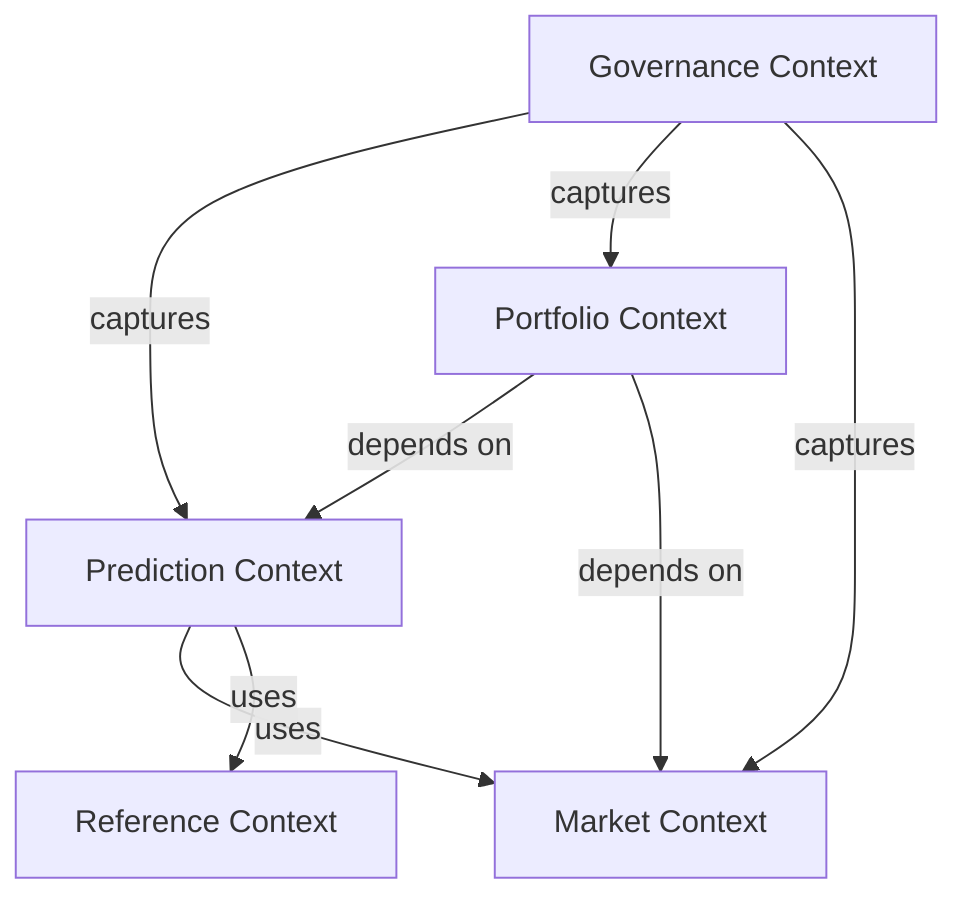
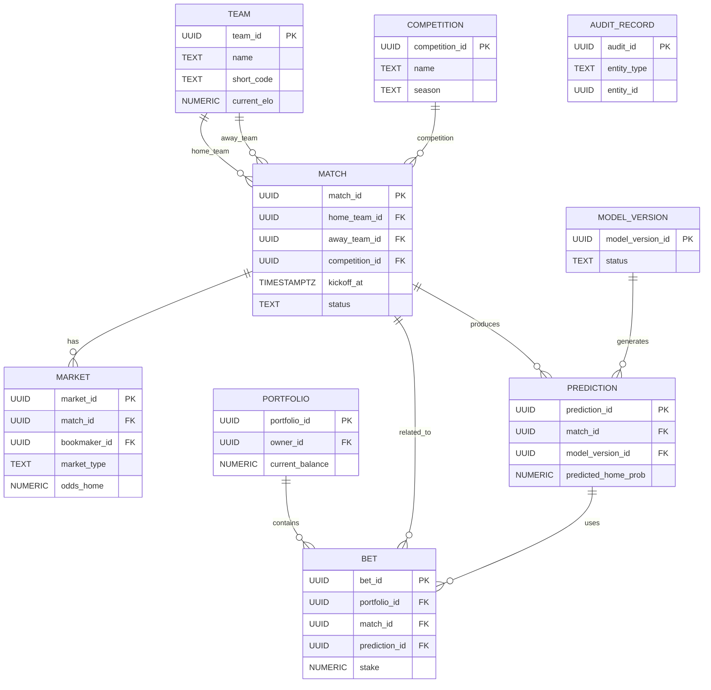

# LigaMX IA Analytics - Domain Model

## 1. Purpose

This document describes the complete domain model for LigaMX IA Analytics. It defines the business entities, aggregates, value objects, repositories, domain services, events, invariants, and bounded contexts that underpin a maintainable Clean Architecture implementation.

It serves as the foundation for the database schema in `05_DATABASE.md`, API contracts in `07_API_SPEC.md`, and business rule enforcement in `03_BUSINESS_RULES.md`.

## 2. Ubiquitous Language

The following terms are used consistently across documentation and implementation.

- **Match**: A scheduled or completed Liga MX fixture.
- **Team**: A Liga MX club participating in a competition.
- **Player**: A roster member eligible for a match.
- **Market**: A bookmaker betting offer for a match outcome or line.
- **Prediction**: A model-generated probability distribution and associated metrics.
- **Portfolio**: A capital container with risk and staking rules.
- **Bet**: A proposed or placed wager on a market outcome.
- **AuditRecord**: An immutable record of domain activity.
- **ModelVersion**: A tracked AI model release with metadata and metrics.
- **Simulation**: A probabilistic match scenario execution.
- **OddsSnapshot**: A captured market state for a match.
- **DatasetSnapshot**: A versioned input dataset used for model training.
- **Expected Value (EV)**: A measure of long-term profitability for a bet.
- **KellyFraction**: Recommended stake proportion derived from edge and odds.

## 3. Bounded Contexts

The domain is separated into explicit bounded contexts to reduce coupling and improve maintainability.

### 3.1 Prediction Context

Responsible for match-level probability estimation, score distributions, and simulation output.

- Entities: `Match`, `Prediction`, `ModelVersion`, `SimulationResult`, `OddsSnapshot`
- Value Objects: `ProbabilityVector`, `ScorelineProbability`, `ExpectedGoalsVector`
- Services: `PredictionService`, `SimulationService`, `CalibrationService`

### 3.2 Portfolio Context

Manages capital allocation, betting positions, exposure, and settlement.

- Entities: `Portfolio`, `Bet`, `RiskConstraint`, `Position`
- Value Objects: `MoneyAmount`, `StakeRecommendation`, `ExposureSummary`
- Services: `PortfolioService`, `BetValidationService`, `RiskEvaluator`

### 3.3 Market Context

Wraps bookmaker odds, implied probabilities, and market normalization.

- Entities: `Market`, `Bookmaker`, `OddsSnapshot`
- Value Objects: `MarketOdds`, `ImpliedProbability`
- Services: `MarketNormalizationService`, `EVCalculator`

### 3.4 Governance Context

Enforces auditability, model lifecycle, and data provenance.

- Entities: `AuditRecord`, `DatasetSnapshot`, `ModelVersion`
- Value Objects: `AuditPayload`, `GovernanceMetadata`
- Services: `AuditService`, `ModelRegistryService`, `DatasetVersioningService`

### 3.5 Reference Context

Stores static and slowly changing entities used across prediction and portfolio workflows.

- Entities: `Team`, `Competition`, `Season`, `Venue`, `Player`
- Value Objects: `TeamRating`, `CompetitionStage`
- Services: `ReferenceDataService`

### 3.6 AI Context

Responsible for feature engineering, model training, model inference, explainability, model lifecycle management, and AI governance.

#### Entities

- Feature
- FeatureSet
- FeatureVersion
- TrainingRun
- Experiment
- ModelArtifact

#### Value Objects

- FeatureVector
- HyperParameters
- TrainingMetrics
- SHAPSummary
- ModelConfidence

#### Services

- FeatureEngineeringService
- TrainingService
- InferenceService
- ExplainabilityService
- ModelEvaluationService

### 3.7 Data Ingestion Context

Responsible for collecting, validating, transforming and importing football data from external providers.

#### Entities

- DataProvider
- ImportJob
- ImportBatch

#### Value Objects

- ImportStatus
- SourceMetadata
- ImportStatistics

#### Services

- ImportService
- ValidationService
- NormalizationService
- SchedulerService

## 4. Entities

## 4.1 Competition

Represents a football competition such as Liga MX, Premier League or UEFA Champions League.

### Attributes

- `competition_id`: UUID
- `name`: string
- `country`: string
- `confederation`: string
- `competition_type`: League | Cup | International
- `tier`: integer
- `is_active`: boolean
- `created_at`: UTC timestamp
- `updated_at`: UTC timestamp

### Behavior

- Maintain competition metadata.
- Support multiple seasons.
- Validate competition uniqueness.

### Relationships

- One Competition contains many Seasons.

### Business Rules

- Competition names must be unique per country.
- A competition cannot be deleted if seasons exist.


---

## 4.2 Season

Represents a competition season.

### Attributes

- `season_id`: UUID
- `competition_id`: UUID
- `name`: string
- `start_date`: date
- `end_date`: date
- `status`: Scheduled | Active | Finished
- `created_at`: UTC timestamp
- `updated_at`: UTC timestamp

### Behavior

- Organize matches by season.
- Manage season lifecycle.

### Relationships

- Belongs to one Competition.
- Contains many Rounds.

### Business Rules

- Only one Active season may exist for a Competition.
- End date must be greater than start date.


---

## 4.3 Round

Represents a league round (Matchday).

### Attributes

- `round_id`: UUID
- `season_id`: UUID
- `number`: integer
- `name`: string
- `start_date`: date
- `end_date`: date

### Behavior

- Group matches into a single competition round.

### Relationships

- Belongs to one Season.
- Contains many Matches.

### Business Rules

- Round number must be unique within a season.
- A match belongs to exactly one round.


---

## 4.4 Team

Represents a professional football club.

### Attributes

- `team_id`: UUID
- `competition_id`: UUID
- `name`: string
- `short_name`: string
- `country`: string
- `city`: string
- `stadium_id`: UUID
- `founded_year`: integer
- `elo_rating`: decimal
- `is_active`: boolean
- `created_at`: UTC timestamp
- `updated_at`: UTC timestamp

### Behavior

- Maintain historical team information.
- Track current Elo rating.
- Associate players and coaching staff.

### Relationships

- Belongs to one Competition.
- Has one home Venue.
- Has many Players.
- Has one active Coach.
- Participates in many Matches.

### Business Rules

- Team names must be unique inside the same competition.
- A team can only have one active head coach.


---

## 4.5 Coach

Represents the head coach of a football team.

### Attributes

- `coach_id`: UUID
- `team_id`: UUID
- `full_name`: string
- `nationality`: string
- `birth_date`: date
- `preferred_formation`: string
- `is_active`: boolean
- `created_at`: UTC timestamp
- `updated_at`: UTC timestamp

### Behavior

- Track coaching history.
- Store tactical preferences.
- Support historical performance analysis.

### Relationships

- Belongs to one Team.

### Business Rules

- Only one active coach per team.
- Historical coaches remain immutable.


---

## 4.6 Player

Represents a professional football player.

### Attributes

- `player_id`: UUID
- `team_id`: UUID
- `full_name`: string
- `shirt_number`: integer
- `position`: Goalkeeper | Defender | Midfielder | Forward
- `preferred_foot`: Left | Right | Both
- `birth_date`: date
- `nationality`: string
- `height_cm`: integer
- `weight_kg`: decimal
- `market_value`: decimal
- `status`: Active | Injured | Suspended | Loan
- `created_at`: UTC timestamp
- `updated_at`: UTC timestamp

### Behavior

- Store player profile.
- Track player availability.
- Associate historical statistics.

### Relationships

- Belongs to one Team.
- Appears in many Lineups.
- Has many PlayerStatistics.

### Business Rules

- Shirt numbers must be unique within a team.
- Players cannot belong to multiple active teams simultaneously.


---

## 4.7 Venue

Represents the stadium where a match is played.

### Attributes

- `venue_id`: UUID
- `name`: string
- `city`: string
- `country`: string
- `capacity`: integer
- `altitude_meters`: decimal
- `surface_type`: Natural | Artificial | Hybrid
- `created_at`: UTC timestamp
- `updated_at`: UTC timestamp

### Behavior

- Store stadium information.
- Support home advantage calculations.

### Relationships

- Can host many Matches.
- Can be assigned as the home stadium of many Teams.

### Business Rules

- Stadium names should be unique within a country.


---

## 4.8 Referee

Represents the official referee assigned to a football match.

### Attributes

- `referee_id`: UUID
- `full_name`: string
- `country`: string
- `category`: FIFA | National
- `experience_years`: integer
- `is_active`: boolean
- `created_at`: UTC timestamp
- `updated_at`: UTC timestamp

### Behavior

- Maintain referee assignments.
- Store historical officiating data.

### Relationships

- Can officiate many Matches.

### Business Rules

- A referee cannot officiate two matches simultaneously.
- Historical referee assignments are immutable.

## 4.9 Match

Represents a scheduled or completed football match.

### Attributes

- `match_id`: UUID
- `competition_id`: UUID
- `season_id`: UUID
- `round_id`: UUID
- `home_team_id`: UUID
- `away_team_id`: UUID
- `venue_id`: UUID
- `referee_id`: UUID
- `kickoff_datetime`: UTC timestamp
- `status`: Scheduled | Live | Finished | Cancelled | Postponed
- `home_score`: integer
- `away_score`: integer
- `home_xg`: decimal
- `away_xg`: decimal
- `attendance`: integer
- `weather`: string
- `created_at`: UTC timestamp
- `updated_at`: UTC timestamp

### Behavior

- Manage the complete match lifecycle.
- Store official match results.
- Associate statistical information.
- Trigger prediction generation.
- Trigger model evaluation after completion.

### Relationships

- Belongs to one Competition.
- Belongs to one Season.
- Belongs to one Round.
- Has one Home Team.
- Has one Away Team.
- Is played at one Venue.
- Has one Referee.
- Has many Markets.
- Has many Lineups.
- Has many PlayerStatistics.
- Has many TeamStatistics.
- Has many Predictions.

### Business Rules

- Home and Away teams must be different.
- Finished matches cannot return to Live status.
- Official scores become immutable after validation.
- A match belongs to exactly one competition and one season.


---

## 4.10 Lineup

Represents the official starting lineup and substitutes.

### Attributes

- `lineup_id`: UUID
- `match_id`: UUID
- `team_id`: UUID
- `formation`: string
- `is_confirmed`: boolean
- `confirmed_at`: UTC timestamp

### Behavior

- Store official lineups.
- Track tactical formations.
- Support prediction updates after lineup confirmation.

### Relationships

- Belongs to one Match.
- Belongs to one Team.
- Contains many Players.

### Business Rules

- Each team has only one official lineup per match.
- Confirmed lineups cannot be modified.


---

## 4.11 PlayerStatistics

Represents an individual player's statistics for one match.

### Attributes

- player_statistics_id: UUID
- player_id: UUID
- match_id: UUID

## Core Statistics

- minutes_played
- goals
- assists
- shots
- shots_on_target
- xg
- xa

## Advanced Metrics

- advanced_metrics: JSONB

Stores provider-specific and experimental metrics (Opta, StatsBomb,
Wyscout, SofaScore, custom engineered metrics, etc.).

## Metadata

- created_at
- updated_at

### Behavior

- Store complete player performance.
- Provide historical statistics for AI models.
- Support feature engineering.

### Relationships

- Belongs to one Player.
- Belongs to one Match.

### Business Rules

- One statistics record per player per match.
- Statistics become immutable after validation.
- Advanced metrics must not duplicate core statistics.


---

## 4.12 TeamStatistics

Represents aggregated team statistics for one match.

### Attributes

- `team_statistics_id`: UUID
- `team_id`: UUID
- `match_id`: UUID

### Core Statistics

- goals
- xg
- possession
- shots
- shots_on_target
- corners

### Advanced Metrics

- advanced_metrics: JSONB

Stores provider-specific and experimental metrics (Opta, StatsBomb,
Wyscout, SofaScore, custom engineered metrics, etc.).

Example:

```json
{
  "ppda": 8.4,
  "field_tilt": 0.61,
  "deep_completions": 15,
  "progressive_passes": 44,
  "expected_threat": 1.28,
  "recoveries": 56
}
```

### Behavior

- Store official team performance.
- Feed prediction models.
- Generate historical trends.

### Relationships

- Belongs to one Team.
- Belongs to one Match.

### Business Rules

- One statistics record per team per match.
- Statistics become immutable after validation.
- Advanced metrics must not duplicate core statistics.

### Metadata

- created_at
- updated_at
---

## 4.13 Bookmaker

Represents a betting operator.

### Attributes

- `bookmaker_id`: UUID
- `name`: string
- `country`: string
- `website`
- `api_provider`
- `status`: Active | Inactive

### Behavior

- Provide betting odds.
- Track bookmaker availability.
- Maintain historical pricing.

### Relationships

- Publishes many Markets.

### Business Rules

- Bookmaker names must be globally unique.
- A bookmaker cannot be deleted while associated markets exist.
- Historical bookmaker information must remain immutable.


---

## 4.14 Market

Represents a betting market.

### Attributes

- `market_id`: UUID
- `match_id`: UUID
- `bookmaker_id`: UUID
- `market_type`
- `selection`
- `opening_odds`
- `current_odds`
- `closing_odds`
- `probability`
- `expected_value`
- `status`
- `last_updated`

### Behavior

- Track odds movement.
- Calculate implied probability.
- Store historical market snapshots.

### Relationships

- Belongs to one Match.
- Belongs to one Bookmaker.
- Can generate many Predictions.

### Business Rules

- Odds history cannot be deleted.
- Closed markets become read-only.


---

## 4.15 Feature

Represents one engineered feature used by machine learning models.

### Attributes

- `feature_id`: UUID
- `name`: string
- `category`: string
- `description`: string
- `data_type`: string
- `source`: string
- `calculation_version`: string
- `is_active`: boolean
- `created_at`: UTC timestamp
- `updated_at`: UTC timestamp

### Behavior

- Define reusable ML features.
- Track feature evolution.
- Maintain feature metadata.

### Relationships

- Belongs to many FeatureSets.
- Used by many TrainingRuns.

### Business Rules

- Feature names must be globally unique.
- Feature definitions are version controlled.

## 4.16 FeatureSet

Represents a versioned collection of engineered features used for training and inference.

### Attributes

- `feature_set_id`: UUID
- `name`: string
- `version`: string
- `description`: string
- `total_features`: integer
- `created_at`: UTC timestamp
- `updated_at`: UTC timestamp
- `created_by`: string

### Behavior

- Group Features into reusable collections.
- Version feature definitions.
- Guarantee feature consistency between training and inference.

### Relationships

- Contains many Features.
- Used by many TrainingRuns.
- Used by many ModelVersions.

### Business Rules

- Feature Set versions are immutable.
- A Feature may belong to multiple Feature Sets.
- Feature Sets must be reproducible.


---

## 4.17 DatasetSnapshot

Represents an immutable snapshot of the dataset used for model training.

### Attributes

- `dataset_snapshot_id`: UUID
- `feature_set_id`: UUID
- `name`: string
- `season_range`: string
- `matches`: integer
- `rows`: integer
- `checksum`: string
- `created_at`: UTC timestamp
- `updated_at`: UTC timestamp

### Behavior

- Preserve historical datasets.
- Enable reproducible training.
- Validate dataset integrity.

### Relationships

- Belongs to one FeatureSet.
- Used by many TrainingRuns.

### Business Rules

- Dataset snapshots are immutable.
- Checksums must be unique.


---

## 4.18 TrainingRun

Represents one machine learning training execution.

### Attributes

- `training_run_id`: UUID
- `model_name`: string
- `algorithm`: string
- `dataset_snapshot_id`: UUID
- `feature_set_id`: UUID
- `hyperparameters`: JSONB
- `training_metrics`: JSONB
- `validation_metrics`: JSONB
- `random_seed`: integer
- `started_at`: UTC timestamp
- `finished_at`: UTC timestamp
- `status`: Pending | Running | Completed | Failed

### Behavior

- Execute model training.
- Record metrics.
- Store experiment metadata.
- Produce ModelVersion artifacts.

### Relationships

- Uses one DatasetSnapshot.
- Uses one FeatureSet.
- Produces one or more ModelVersions.

### Business Rules

- TrainingRuns are immutable after completion.
- Every completed TrainingRun must generate at least one ModelVersion.


---

## 4.19 ModelVersion

Represents a deployable machine learning model.

### Attributes

- `model_version_id`: UUID
- `training_run_id`: UUID
- `model_name`: string
- `version`: string
- `framework`: string
- `algorithm`: string
- `artifact_path`: string
- `mlflow_run_id`: string
- `git_commit_hash`: string
- `accuracy`: decimal
- `precision`: decimal
- `recall`: decimal
- `f1_score`: decimal
- `roc_auc`: decimal
- `status`: Candidate | Production | Archived
- `created_at`: UTC timestamp
- `updated_at`: UTC timestamp

### Behavior

- Version trained models.
- Track production deployments.
- Store evaluation metrics.

### Relationships

- Produced by one TrainingRun.
- Generates many Predictions.

### Business Rules

- Only one Production version may exist per model.
- Archived models cannot generate predictions.


---

## 4.20 Prediction

Represents an AI-generated prediction for a betting market.

### Attributes

- `prediction_id`: UUID
- `match_id`: UUID
- `market_id`: UUID
- `model_version_id`: UUID
- `feature_set_id`: UUID
- `dataset_snapshot_id`: UUID
- `predicted_probability`: decimal
- `fair_odds`: decimal
- `expected_value`: decimal
- `confidence_score`: decimal
- `kelly_fraction`: decimal
- `recommended_stake`: decimal
- `inference_time_ms`: integer
- `prediction_timestamp`: UTC timestamp
- `explanation`: JSONB
- `status`: Pending | Published | Archived

### Behavior

- Generate betting recommendations.
- Store prediction metadata.
- Provide explainability.
- Support post-match evaluation.

### Relationships

- Belongs to one Match.
- Belongs to one Market.
- Generated by one ModelVersion.
- Uses one FeatureSet.
- Uses one DatasetSnapshot.
- Can originate many Bets.

### Business Rules

- Predictions are immutable after publication.
- Every Prediction must reference exactly one ModelVersion.
- Every Prediction must reference exactly one FeatureSet.
- Every Prediction must reference exactly one DatasetSnapshot.

---

## 4.21 Portfolio

Represents the betting portfolio managed by the platform.

### Attributes

- `portfolio_id`: UUID
- `name`: string
- `currency`: string
- `initial_bankroll`: decimal
- `current_bankroll`: decimal
- `risk_profile`: Conservative | Balanced | Aggressive
- `created_at`: UTC timestamp
- `updated_at`: UTC timestamp

### Behavior

- Manage bankroll.
- Calculate ROI.
- Track profitability.
- Evaluate betting performance.

### Relationships

- Contains many Bets.

### Business Rules

- Bankroll cannot become negative.
- Currency cannot change after creation.


---

## 4.22 Bet

Represents one executed betting position.

### Attributes

- `bet_id`: UUID
- `portfolio_id`: UUID
- `prediction_id`: UUID
- `bookmaker_id`: UUID
- `stake`: decimal
- `odds`: decimal
- `potential_profit`: decimal
- `profit_loss`: decimal
- `result`: Pending | Won | Lost | Void
- `placed_at`: UTC timestamp
- `settled_at`: UTC timestamp

### Behavior

- Record betting activity.
- Calculate bankroll impact.
- Evaluate Expected Value performance.

### Relationships

- Belongs to one Portfolio.
- References one Prediction.
- References one Bookmaker.

### Business Rules

- Stakes must be greater than zero.
- Settled bets become immutable.


---

## 4.23 AuditRecord

Represents an immutable audit trail for critical system events.

### Attributes

- `audit_record_id`: UUID
- `entity_name`: string
- `entity_id`: UUID
- `event_type`: string
- `old_value`: JSONB
- `new_value`: JSONB
- `performed_by`: string
- `performed_at`: UTC timestamp
- `ip_address`: string

### Behavior

- Track domain changes.
- Support compliance.
- Enable forensic analysis.

### Relationships

- Can reference any Aggregate Root.

### Business Rules

- Audit records are immutable.
- Audit records cannot be deleted.
- Every critical domain event must generate an AuditRecord.

## 5. Value Objects

### 5.1 ProbabilityVector

Represents win/draw/loss probabilities.

- `home_probability`: decimal
- `draw_probability`: decimal
- `away_probability`: decimal
- `normalize()`: ensures the total equals 1.0.
- `is_valid()`: checks probabilities are between 0 and 1.

### 5.2 ExpectedGoalsVector

Encapsulates expected goals.

- `home_goals`: decimal
- `away_goals`: decimal
- `total_goals`: decimal
- `difference`: decimal

### 5.3 MarketEdge

- `implied_probability`: decimal
- `predicted_probability`: decimal
- `edge`: decimal
- `expected_value`: decimal
- `odds`: decimal
- `market_type`: string

### 5.4 StakeRecommendation

- `recommended_stake`: decimal
- `kelly_fraction`: decimal
- `fractional_kelly`: decimal
- `max_stake`: decimal

### 5.5 ExposureSummary

- `current_exposure`: decimal
- `max_exposure`: decimal
- `match_concentration`: decimal

### 5.6 AuditPayload

- `source_data`: JSONB
- `calculation_context`: JSONB
- `outcome`: JSONB

### 5.7 Money

### 5.8 Odds

### 5.9 Percentage

### 5.10 ConfidenceIndex

### 5.11 FeatureVector

### 5.12 SimulationParameters

## 6. Repositories

### 6.1 MatchRepository

- `get_by_id(match_id)`
- `find_scheduled_for_range(start, end)`
- `save(match)`

### 6.2 PredictionRepository

- `get_by_id(prediction_id)`
- `find_by_match(match_id)`
- `save(prediction)`
- `find_by_model_version(model_version_id)`

### 6.3 MarketRepository

- `find_by_match(match_id)`
- `save(market)`
- `find_snapshot_by_timestamp(match_id, timestamp)`

### 6.4 PortfolioRepository

- `get_by_id(portfolio_id)`
- `save(portfolio)`
- `find_open(portfolio_id)`

### 6.5 BetRepository

- `get_by_id(bet_id)`
- `find_by_portfolio(portfolio_id)`
- `save(bet)`

### 6.6 ModelVersionRepository

- `get_by_id(model_version_id)`
- `save(model_version)`
- `find_active_versions()`

### 6.7 AuditRepository

- `save(audit_record)`
- `search(filters)`

### 6.8 DatasetSnapshotRepository

- `get_by_version(version)`
- `save(dataset_snapshot)`


## 7. Domain Services

### 7.1 PredictionService

Encapsulates match probability generation.

- `generate_prediction(match_id, model_version_id, scenario)`
- `compute_expected_goals(match, team_stats)`
- `calculate_score_distribution(probabilities)`
- `persist_prediction(prediction)`

### 7.2 SimulationService

Executes scenario simulations.

- `run_monte_carlo(prediction, iterations)`
- `run_bivariate_poisson(prediction)`
- `generate_simulation_summary()`

### 7.3 MarketNormalizationService

- `normalize_odds(odds)`
- `compute_implied_probability(odds)`
- `remove_overround(implied_probs)`

### 7.4 EVCalculator

- `calculate_edge(predicted_probability, implied_probability)`
- `calculate_expected_value(edge, odds)`

### 7.5 PortfolioService

Orchestrates portfolio operations.

- `recommend_stake(portfolio, bet_candidate)`
- `validate_bet(portfolio, bet)`
- `place_bet(portfolio, bet)`
- `settle_bet(bet, market_result)`

### 7.6 RiskEvaluator

Enforces exposure and concentration rules.

- `validate_max_risk(portfolio, bets)`
- `validate_match_concentration(portfolio, match_id)`

### 7.7 AuditService

- `record_event(entity_type, entity_id, action, payload, user_id)`
- `query_audit(filters)`

### 7.8 ModelRegistryService

- `register_model(name, dataset_snapshot_id, params, metrics)`
- `promote_model(version_id, target_status)`
- `retire_model(version_id)`

### 7.9 DatasetVersioningService

- `capture_snapshot(source, hash, metadata)`
- `resolve_snapshot(version)`

## 8. Domain Events

- `PredictionGenerated(match_id, prediction_id, model_version_id, created_at)`
- `SimulationCompleted(prediction_id, simulation_id, sample_size)`
- `CandidateBetIdentified(bet_id, portfolio_id, edge)`
- `BetPlaced(bet_id, portfolio_id, match_id, placed_at)`
- `BetSettled(bet_id, outcome, pnl, settled_at)`
- `ModelVersionPromoted(model_version_id, status, promoted_at)`
- `AuditRecordCreated(audit_id, entity_type, entity_id, action)`

Events are used to decouple services, update read models, and drive asynchronous workflows in `06_ARCHITECTURE.md`.

## 9. Invariants

- A `Prediction` must reference an existing `Match` and `ModelVersion`.
- `ProbabilityVector` values must sum to 1.0.
- `Market` odds must be positive and valid for the market type.
- A `Portfolio` must enforce `max_risk_pct`, `min_kelly_pct`, and `max_bet_pct`.
- `Bet` placement must occur before `match.kickoff_at`.
- `AuditRecord` entries must be immutable.
- `ModelVersion` status transitions must follow `draft -> staging -> production -> retired`.

## 10. Relationships

- `Match` 1..* `Market`
- `Match` 1..* `Prediction`
- `Prediction` 1 `ModelVersion`
- `Portfolio` 1..* `Bet`
- `Bet` 1 `Prediction`
- `Bet` 1 `Match`
- `Bet` 1 `Market`
- `AuditRecord` references any entity via `entity_type` and `entity_id`
- `ModelVersion` 1 `DatasetSnapshot`

## 11. Aggregate Roots

- `Prediction` is root for the prediction context.
- `Portfolio` is root for bankroll and bet operations.
- `ModelVersion` is root for AI governance.
- `AuditRecord` is root for compliance history.
- `Match` is root for fixture and schedule management.

## 12. Mermaid Diagrams

### 12.1 Bounded Context Diagram



### 12.2 Entity Relationship Diagram



## 13. References

- `03_BUSINESS_RULES.md` for domain rule enforcement.
- `04_AI_ENGINE.md` for prediction algorithms and model versioning.
- `05_DATABASE.md` for schema mapping and persistence.
- `07_API_SPEC.md` for resource exposure.
- `06_ARCHITECTURE.md` for component integration.
