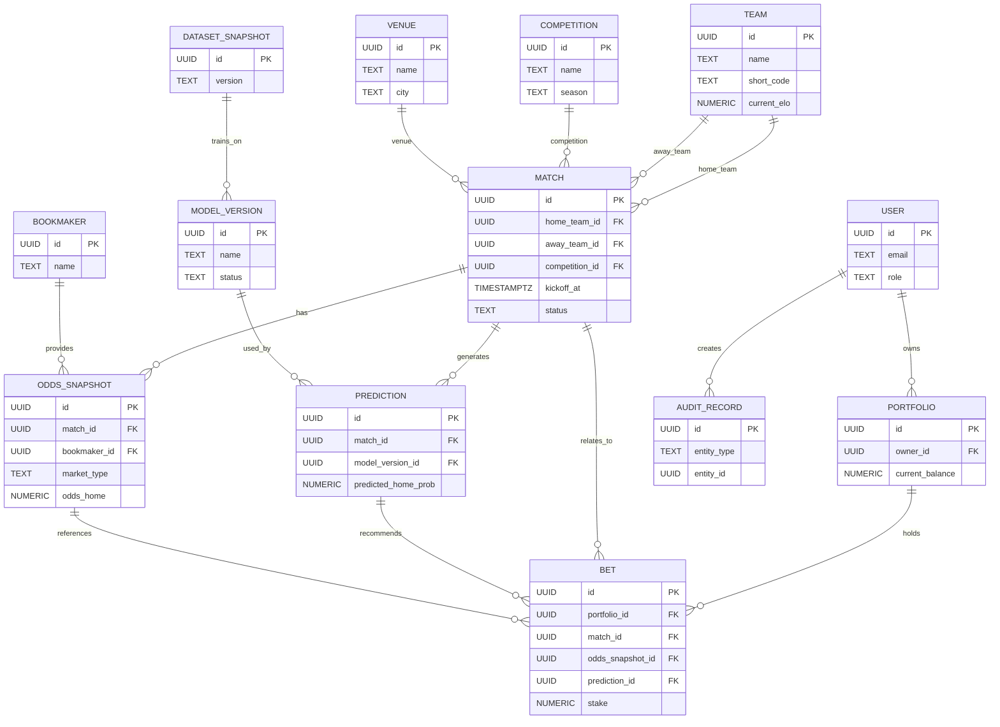

# LigaMX IA Analytics - Database Design

## 1. Purpose

This document defines the entire database design for LigaMX IA Analytics. It describes schema definitions, relationships, constraints, indexes, UUID strategy, audit tables, partitioning, naming conventions, migration strategy, and ER diagrams.

It is aligned with the domain model in `02_DOMAIN_MODEL.md`, the business rules in `03_BUSINESS_RULES.md`, and the API in `07_API_SPEC.md`.

## 2. Database Principles

- Use normalized relational schema for core domain entities.
- Enforce business invariants at the database layer where possible.
- Preserve audit history using append-only storage.
- Optimize query patterns for dashboards, backtests, and predictions.
- Support long-term growth with partitioning and indexing.

## 3. Schema Overview

The schema includes the following domains:
- Reference data: `team`, `competition`, `venue`, `player`, `bookmaker`
- Fixture and market data: `match`, `market`, `odds_snapshot`
- Prediction and AI: `model_version`, `dataset_snapshot`, `prediction`
- Portfolio and betting: `portfolio`, `bet`
- Governance and audit: `audit_record`, `user`

## 4. Tables and Columns

### 4.1 team

- `id` UUID PRIMARY KEY
- `name` TEXT NOT NULL
- `short_code` TEXT NOT NULL UNIQUE
- `country` TEXT NOT NULL
- `home_advantage` NUMERIC(5,3) NOT NULL DEFAULT 0.0
- `current_elo` NUMERIC(10,4) NOT NULL DEFAULT 1500.0
- `created_at` TIMESTAMPTZ NOT NULL DEFAULT now()
- `updated_at` TIMESTAMPTZ NOT NULL DEFAULT now()

### 4.2 competition

- `id` UUID PRIMARY KEY
- `name` TEXT NOT NULL
- `season` TEXT NOT NULL
- `category` TEXT NOT NULL
- `start_date` DATE
- `end_date` DATE
- `created_at` TIMESTAMPTZ NOT NULL DEFAULT now()
- `updated_at` TIMESTAMPTZ NOT NULL DEFAULT now()

### 4.3 venue

- `id` UUID PRIMARY KEY
- `name` TEXT NOT NULL
- `city` TEXT NOT NULL
- `country` TEXT NOT NULL
- `capacity` INTEGER
- `created_at` TIMESTAMPTZ NOT NULL DEFAULT now()
- `updated_at` TIMESTAMPTZ NOT NULL DEFAULT now()

### 4.4 player

- `id` UUID PRIMARY KEY
- `team_id` UUID NOT NULL REFERENCES team(id)
- `name` TEXT NOT NULL
- `position` TEXT NOT NULL
- `rating` NUMERIC(5,2)
- `status` TEXT NOT NULL CHECK (status IN ('active','injured','suspended'))
- `created_at` TIMESTAMPTZ NOT NULL DEFAULT now()
- `updated_at` TIMESTAMPTZ NOT NULL DEFAULT now()

### 4.5 bookmaker

- `id` UUID PRIMARY KEY
- `name` TEXT NOT NULL UNIQUE
- `website` TEXT
- `created_at` TIMESTAMPTZ NOT NULL DEFAULT now()
- `updated_at` TIMESTAMPTZ NOT NULL DEFAULT now()

### 4.6 match

- `id` UUID PRIMARY KEY
- `home_team_id` UUID NOT NULL REFERENCES team(id)
- `away_team_id` UUID NOT NULL REFERENCES team(id)
- `competition_id` UUID NOT NULL REFERENCES competition(id)
- `venue_id` UUID REFERENCES venue(id)
- `kickoff_at` TIMESTAMPTZ NOT NULL
- `status` TEXT NOT NULL CHECK (status IN ('scheduled','in_progress','finished','cancelled'))
- `home_score` INTEGER DEFAULT 0
- `away_score` INTEGER DEFAULT 0
- `source` TEXT NOT NULL
- `created_at` TIMESTAMPTZ NOT NULL DEFAULT now()
- `updated_at` TIMESTAMPTZ NOT NULL DEFAULT now()

Constraints:
- UNIQUE (`home_team_id`,`away_team_id`,`kickoff_at`,`competition_id`)
- CHECK (`home_team_id <> away_team_id`)

Indexes:
- `match_kickoff_idx` ON (`kickoff_at`)
- `match_status_idx` ON (`status`)
- `match_team_idx` ON (`home_team_id`, `away_team_id`)

### 4.7 odds_snapshot

- `id` UUID PRIMARY KEY
- `match_id` UUID NOT NULL REFERENCES match(id)
- `bookmaker_id` UUID NOT NULL REFERENCES bookmaker(id)
- `market_type` TEXT NOT NULL CHECK (market_type IN ('1X2','OverUnder','CorrectScore','AsianHandicap'))
- `odds_home` NUMERIC(8,4)
- `odds_draw` NUMERIC(8,4)
- `odds_away` NUMERIC(8,4)
- `line_value` NUMERIC(6,3)
- `implied_home_prob` NUMERIC(8,6)
- `implied_draw_prob` NUMERIC(8,6)
- `implied_away_prob` NUMERIC(8,6)
- `normalized_implied_proba` JSONB
- `timestamp` TIMESTAMPTZ NOT NULL
- `created_at` TIMESTAMPTZ NOT NULL DEFAULT now()
- `updated_at` TIMESTAMPTZ NOT NULL DEFAULT now()

Indexes:
- `odds_match_timestamp_idx` ON (`match_id`,`timestamp`)
- `odds_bookmaker_idx` ON (`bookmaker_id`)

### 4.8 model_version

- `id` UUID PRIMARY KEY
- `name` TEXT NOT NULL UNIQUE
- `description` TEXT
- `status` TEXT NOT NULL CHECK (status IN ('draft','staging','production','retired'))
- `dataset_snapshot_id` UUID NOT NULL REFERENCES dataset_snapshot(id)
- `training_parameters` JSONB NOT NULL
- `evaluation_metrics` JSONB NOT NULL
- `release_notes` TEXT
- `released_at` TIMESTAMPTZ
- `created_at` TIMESTAMPTZ NOT NULL DEFAULT now()
- `updated_at` TIMESTAMPTZ NOT NULL DEFAULT now()

Indexes:
- `model_status_idx` ON (`status`)
- `model_dataset_idx` ON (`dataset_snapshot_id`)

### 4.9 dataset_snapshot

- `id` UUID PRIMARY KEY
- `version` TEXT NOT NULL UNIQUE
- `source` TEXT NOT NULL
- `hash` TEXT NOT NULL
- `metadata` JSONB
- `created_at` TIMESTAMPTZ NOT NULL DEFAULT now()

### 4.10 prediction

- `id` UUID PRIMARY KEY
- `match_id` UUID NOT NULL REFERENCES match(id)
- `model_version_id` UUID NOT NULL REFERENCES model_version(id)
- `predicted_home_prob` NUMERIC(8,6) NOT NULL
- `predicted_draw_prob` NUMERIC(8,6) NOT NULL
- `predicted_away_prob` NUMERIC(8,6) NOT NULL
- `expected_goals_home` NUMERIC(8,4) NOT NULL
- `expected_goals_away` NUMERIC(8,4) NOT NULL
- `score_distribution` JSONB NOT NULL
- `calibration_metrics` JSONB NOT NULL
- `explanation_summary` JSONB NOT NULL
- `created_at` TIMESTAMPTZ NOT NULL DEFAULT now()
- `updated_at` TIMESTAMPTZ NOT NULL DEFAULT now()

Constraints:
- UNIQUE (`match_id`,`model_version_id`)

Indexes:
- `prediction_match_model_idx` ON (`match_id`,`model_version_id`)
- `prediction_created_idx` ON (`created_at`)

### 4.11 portfolio

- `id` UUID PRIMARY KEY
- `owner_id` UUID NOT NULL REFERENCES "user"(id)
- `name` TEXT NOT NULL
- `currency` TEXT NOT NULL
- `starting_capital` NUMERIC(14,2) NOT NULL
- `current_balance` NUMERIC(14,2) NOT NULL
- `available_capital` NUMERIC(14,2) NOT NULL
- `max_risk_pct` NUMERIC(5,4) NOT NULL
- `min_kelly_pct` NUMERIC(5,4) NOT NULL
- `max_bet_pct` NUMERIC(5,4) NOT NULL
- `created_at` TIMESTAMPTZ NOT NULL DEFAULT now()
- `updated_at` TIMESTAMPTZ NOT NULL DEFAULT now()

### 4.12 bet

- `id` UUID PRIMARY KEY
- `portfolio_id` UUID NOT NULL REFERENCES portfolio(id)
- `match_id` UUID NOT NULL REFERENCES match(id)
- `odds_snapshot_id` UUID NOT NULL REFERENCES odds_snapshot(id)
- `prediction_id` UUID NOT NULL REFERENCES prediction(id)
- `stake` NUMERIC(14,2) NOT NULL
- `recommended_stake` NUMERIC(14,2) NOT NULL
- `odds` NUMERIC(8,4) NOT NULL
- `edge` NUMERIC(10,6) NOT NULL
- `expected_value` NUMERIC(10,6) NOT NULL
- `kelly_fraction` NUMERIC(8,6) NOT NULL
- `status` TEXT NOT NULL CHECK (status IN ('proposed','placed','settled','rejected'))
- `outcome` TEXT CHECK (outcome IN ('won','lost','void','pending'))
- `pnl` NUMERIC(14,2) DEFAULT 0.0
- `placed_at` TIMESTAMPTZ
- `settled_at` TIMESTAMPTZ
- `created_at` TIMESTAMPTZ NOT NULL DEFAULT now()
- `updated_at` TIMESTAMPTZ NOT NULL DEFAULT now()

Indexes:
- `bet_portfolio_status_idx` ON (`portfolio_id`,`status`)
- `bet_match_idx` ON (`match_id`)
- `bet_prediction_idx` ON (`prediction_id`)

### 4.13 audit_record

- `id` UUID PRIMARY KEY
- `entity_type` TEXT NOT NULL
- `entity_id` UUID NOT NULL
- `action` TEXT NOT NULL CHECK (action IN ('create','update','generate','simulate','settle','promote'))
- `payload` JSONB NOT NULL
- `user_id` UUID REFERENCES "user"(id)
- `created_at` TIMESTAMPTZ NOT NULL DEFAULT now()

Indexes:
- `audit_entity_idx` ON (`entity_type`,`entity_id`)
- `audit_user_idx` ON (`user_id`)
- `audit_created_idx` ON (`created_at`)
- `audit_payload_gin_idx` ON USING GIN (`payload`)

### 4.14 "user"

- `id` UUID PRIMARY KEY
- `email` TEXT NOT NULL UNIQUE
- `full_name` TEXT NOT NULL
- `role` TEXT NOT NULL CHECK (role IN ('analyst','manager','auditor','admin'))
- `is_active` BOOLEAN NOT NULL DEFAULT TRUE
- `created_at` TIMESTAMPTZ NOT NULL DEFAULT now()
- `updated_at` TIMESTAMPTZ NOT NULL DEFAULT now()

## 5. Relationships

- `match` references `team`, `competition`, and `venue`.
- `odds_snapshot` references `match` and `bookmaker`.
- `prediction` references `match` and `model_version`.
- `bet` references `portfolio`, `match`, `odds_snapshot`, and `prediction`.
- `model_version` references `dataset_snapshot`.
- `audit_record` references any entity by type and ID.

## 6. Index Strategy

- B-tree indexes on all foreign keys.
- Composite indexes for match and timestamp lookups.
- Unique indexes for model version names and match predictions.
- Partial indexes for open bets and active portfolios.
- JSONB GIN indexes for audit payloads.

## 7. UUID Strategy

- Use UUIDv4 for all primary keys.
- Generate identifiers in application code before persistence.
- Use UUIDs for cross-service correlation and audit tracing.

## 8. Audit Tables and Partitioning

### 8.1 Audit Storage

- `audit_record` is append-only.
- Audit payloads contain event metadata, calculation context, and user details.

### 8.2 Partitioning Strategy

- Partition `audit_record` by `created_at` monthly or quarterly in production.
- Partition `odds_snapshot` by `timestamp` year for large datasets.
- Consider partitioned `prediction` or `bet` tables if scale demands.

## 9. Constraints and Data Integrity

- Foreign key constraints enforce referential integrity.
- Check constraints validate enums and numeric bounds.
- Unique constraints prevent duplicate matches, predictions, and model names.
- Triggers or application logic ensure `home_team_id <> away_team_id`.
- Database constraints validate portfolio limits and bet amounts where possible.

## 10. Naming Conventions

- Tables use singular nouns: `team`, `match`, `prediction`.
- Columns use `snake_case`.
- Primary keys are `id`.
- Foreign keys follow `{entity}_id`.
- Index names use `{table}_{columns}_idx`.
- Constraint names use `{table}_{column}_check` or `{table}_{columns}_key`.

## 11. Migration Strategy

- Use Alembic for schema migrations.
- Create small, focused migration scripts.
- Keep migrations reversible when possible.
- Use data migrations only when needed for schema changes.
- Test migrations with production-like data.

## 12. ER Diagrams

### 12.1 High-Level ER Diagram

## 13. Maintenance and Operations

- Monitor index usage and query plans.
- Archive large historical datasets in object storage if necessary.
- Use read replicas for analytics and reporting workloads.
- Apply periodic vacuum and analyze operations.

## 14. Security

- Use role-based access at the application layer.
- Limit database user permissions to required operations.
- Store secrets outside the repository.
- Use SSL/TLS for database connections.

## 15. References

- `02_DOMAIN_MODEL.md` for entity definitions and aggregate boundaries.
- `03_BUSINESS_RULES.md` for integrity and rule enforcement.
- `04_AI_ENGINE.md` for model storage and prediction artifacts.
- `06_ARCHITECTURE.md` for persistence integration.
- `07_API_SPEC.md` for data contracts and payload expectations.

- `02_DOMAIN_MODEL.md` for entity relationships and aggregate rules.
- `03_BUSINESS_RULES.md` for business-level constraints.
- `04_AI_ENGINE.md` for model versioning and prediction storage.
- `06_ARCHITECTURE.md` for database integration with service layers.
- `07_API_SPEC.md` for data contract and query patterns.
