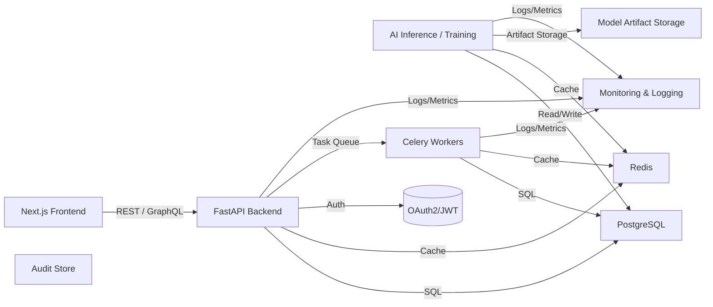

# LigaMX IA Analytics - Architecture

## 1. Introduction

This document defines the system architecture for LigaMX IA Analytics. It describes the overall system decomposition, Clean Architecture and DDD patterns, folder structure, dependency flow, modules, infrastructure, security, logging, configuration, secrets, CI/CD, deployment, scalability, caching, monitoring, and observability.

It is a reference for implementation teams and operations staff building production-ready services.

## 2. System Architecture

LigaMX IA Analytics is composed of the following logical systems:
- Backend API service
- AI inference and training services
- Data ingestion and ETL services
- Frontend dashboard
- Persistence and cache
- Asynchronous task workers
- Monitoring and governance

The architecture follows a modular service decomposition aligned with business domains: predictions, portfolio, market data, model governance, and audit.

### 2.1 Architecture Diagram



## 3. Clean Architecture

### 3.1 Principles

- Domain logic is isolated from frameworks.
- Dependencies point inward from frameworks to domain.
- Domain entities and services do not depend on external infrastructure.
- Interfaces define application boundaries.

### 3.2 Layers

- **Domain layer**: core entities, value objects, aggregates, domain services.
- **Application layer**: use cases, orchestrators, DTOs.
- **Infrastructure layer**: repositories, database adapters, external integrations.
- **Interfaces layer**: API controllers, web routes, CLI entry points.

### 3.3 Benefits

- Testable business logic.
- Replaceable infrastructure.
- Clear separation of concerns.
- Easier long-term maintenance.

## 4. Domain Driven Design

### 4.1 Bounded Contexts

- Prediction Context
- Portfolio Context
- Market Context
- Governance Context
- Reference Context

Each bounded context has its own model, entities, services, and repository interfaces.

### 4.2 Aggregates

- `Prediction` aggregate root for prediction workflows.
- `Portfolio` aggregate root for bankroll and bet workflows.
- `ModelVersion` aggregate root for governance workflows.
- `AuditRecord` aggregate root for compliance.

### 4.3 Ubiquitous Language

Terms are consistent across code, docs, and API: Match, Prediction, Market, Portfolio, Bet, ModelVersion, AuditRecord, DatasetSnapshot.

## 5. Folder Structure

A recommended backend folder structure is:

```text
backend/
  src/
    liga_mx/
      domain/
        entities/
        value_objects/
        services/
        events/
      application/
        use_cases/
        dtos/
      infrastructure/
        repositories/
        persistence/
        cache/
        auth/
        external/
      interfaces/
        api/
          routes/
          schemas/
          dependencies.py
      ai/
        training/
        inference/
        explainability/
      config/
      main.py
  tests/
    unit/
    integration/
```

Frontend structure:

```text
frontend/
  app/
    dashboard/
    predictions/
    portfolios/
    models/
    audit/
  components/
  lib/
    api/
    hooks/
    stores/
    types/
  styles/
  utils/
```

## 6. Dependency Flow

### 6.1 Backend Flow

- HTTP requests enter `interfaces.api`.
- Controllers convert requests into DTOs.
- Use cases orchestrate domain services and repositories.
- Infrastructure adapters implement persistence and external integrations.
- Responses are converted to API schemas.

### 6.2 AI Flow

- Training pipeline reads from versioned dataset snapshots.
- Feature engineering produces deterministic inputs.
- Models are trained, evaluated, and persisted as artifacts.
- Inference layer loads production model versions for prediction.

### 6.3 Data Flow

- Ingestion writes teams, matches, markets into PostgreSQL.
- Prediction services read reference data and write predictions.
- Portfolio services read predictions, bets, and write settlements.
- Audit service writes immutable records for every domain action.

## 7. Modules

### 7.1 Prediction Module

- Prediction engine
- Score distribution generator
- Simulation engine
- Model inference adapter

### 7.2 Portfolio Module

- Portfolio management
- Bet recommendations
- Exposure evaluation
- Settlement processing

### 7.3 Market Module

- Odds normalization
- Market data ingestion
- EV and edge calculation

### 7.4 Governance Module

- Model registry
- Dataset snapshot service
- Audit service
- User and role management

### 7.5 Infrastructure Module

- PostgreSQL persistence
- Redis cache and Celery broker
- Docker environment
- Monitoring and logging

## 8. Docker

### 8.1 Local Environment

- Use `docker-compose.yml` for local development.
- Services include `backend`, `frontend`, `postgres`, `redis`, `celery-worker`, `celery-beat`.
- Use named volumes and explicit port mappings.

### 8.2 Production Builds

- Use multi-stage Docker builds for backend and frontend.
- Build artifacts are immutable and environment agnostic.
- Keep image sizes minimal and secure.

### 8.3 Configuration

- Docker images should read configuration from environment variables.
- Avoid storing secrets in Dockerfiles or version-controlled compose files.

## 9. Redis

### 9.1 Usage

- Cache prediction summaries, portfolio summaries, dashboard aggregates.
- Use Redis as Celery broker and result backend.
- Use TTLs for ephemeral objects and explicit invalidation for version-dependent caches.

### 9.2 Patterns

- Key naming: `prediction:{id}`, `portfolio:{id}:summary`, `audit:recent`
- Use hash or JSON structures for complex cached objects.
- Invalidate caches when underlying data changes, especially after model promotion or portfolio updates.

## 10. Celery

### 10.1 Responsibilities

- Run simulations, backtests, and model training tasks asynchronously.
- Process long-running workloads outside request scope.

### 10.2 Reliability

- Configure retries for transient failures.
- Use idempotent tasks where possible.
- Monitor Celery queue lengths, worker status, and task latencies.

### 10.3 Deployment

- Run worker instances separately from the API service.
- Scale workers independently based on task volume.

## 11. Security

### 11.1 Authentication

- Use OAuth2 with JWT bearer tokens.
- Issue access tokens with configurable expiration.
- Use secure token storage on the client side.

### 11.2 Authorization

- Enforce RBAC at the service and API layers.
- Validate user roles for admin, manager, analyst, auditor.
- Protect all sensitive operations with policy checks.

### 11.3 Network Security

- Use TLS for all production traffic.
- Restrict database and Redis access to trusted internal networks.
- Use firewalls or security groups in cloud deployments.

### 11.4 Secrets Management

- Store secrets in a vault or environment-specific secret manager.
- Do not commit secrets to Git.
- Rotate secrets regularly.

## 12. Logging

### 12.1 Structured Logs

- Use JSON-formatted logs for backend and tasks.
- Include fields: timestamp, service, request_id, correlation_id, user_id, severity.

### 12.2 Correlation

- Propagate `X-Correlation-ID` across API requests and task workflows.
- Use correlation IDs to trace end-to-end request flows.

### 12.3 Log Retention

- Retain logs according to operational policy.
- Ensure logs are searchable by request_id, entity_id, and error code.

## 13. Configuration

### 13.1 Environment Patterns

- Use environment variables for all configuration.
- Support local `.env` files for development only.
- Keep production configuration external and managed securely.

### 13.2 Typed Configuration

- Map environment variables into typed configuration objects.
- Validate required configuration values at startup.

### 13.3 Feature Flags

- Use feature flags for experimental AI models or UI features.
- Keep default behavior stable.

## 14. Secrets

### 14.1 Storage

- Use secure secret management solutions for production.
- Avoid embedding credentials in source code.

### 14.2 Access Control

- Limit secret visibility to necessary deployment pipelines.
- Use distinct secrets for development, staging, and production.

## 15. CI/CD

### 15.1 Pipeline Stages

- Linting and formatting
- Static typing checks
- Unit and integration tests
- API contract validation
- Docker image build and scan
- Artifact publish
- Deployment to staging/production

### 15.2 Branching and Promotion

- Use feature branches for work in progress.
- Merge to `develop` or `main` after review.
- Deploy from tagged releases.

### 15.3 Rollback

- Use immutable artifacts for safe rollback.
- Ensure deployment tooling can revert to prior stable image.

## 16. Deployment

### 16.1 Environments

- Local development
- Staging
- Production

### 16.2 Deployment Strategy

- Deploy backend and frontend separately.
- Use zero-downtime deployment patterns where possible.
- Validate readiness with health checks.

### 16.3 Database Deployment

- Apply Alembic migrations as part of deployment.
- Validate migrations in staging before production.
- Use backup and rollback plans for schema changes.

## 17. Scalability

### 17.1 Service Scaling

- Scale backend API horizontally.
- Scale Celery workers for asynchronous tasks.
- Use Redis and database replicas for load distribution.

### 17.2 Data Scaling

- Partition audit and historical data when volume grows.
- Keep prediction and bet tables indexed for dashboard queries.

### 17.3 AI Scaling

- Separate training infrastructure from inference services.
- Use batch compute for model retraining.

## 18. Caching

### 18.1 Cache Strategy

- Cache stable read-heavy data such as match reference data.
- Cache prediction summaries and dashboard aggregates.
- Use versioned cache keys to avoid stale results.

### 18.2 Invalidation

- Invalidate caches on write operations.
- Use explicit cache refresh when model versions are promoted.

## 19. Monitoring

### 19.1 Metrics

- API latency and error rates.
- Redis and Celery queue health.
- Database connection counts and slow queries.
- Model inference durations.

### 19.2 Alerts

- Alert on service downtime.
- Alert on backtest or training failure.
- Alert on model drift and calibration degradation.

### 19.3 Dashboards

- Provide operational dashboards for system health.
- Provide business dashboards for prediction and portfolio KPIs.

## 20. Observability

- Use health endpoints with readiness and liveness probes.
- Correlate logs, traces, and metrics.
- Use request tracing for end-to-end workflows.
- Capture audit events for compliance.

## 21. References

- `00_PROJECT_CHARTER.md`
- `02_DOMAIN_MODEL.md`
- `03_BUSINESS_RULES.md`
- `04_AI_ENGINE.md`
- `05_DATABASE.md`
- `07_API_SPEC.md`
- `09_DEVELOPMENT_RULES.md`
