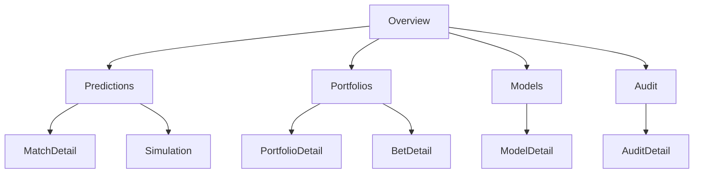
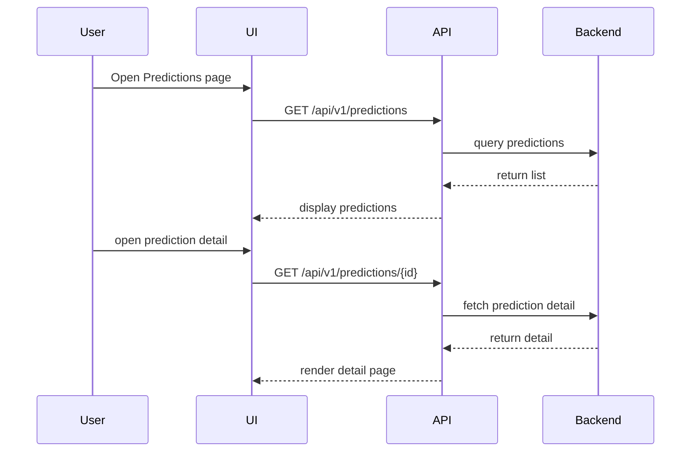

# LigaMX IA Analytics - UI / UX

## 1. Introduction

This document describes the frontend design for LigaMX IA Analytics. It defines pages, navigation, dashboards, components, interaction patterns, accessibility, responsive design, dark mode, charts, tables, filters, forms, notifications, loading and error states, user flows, and wireframes.

The design supports production-grade usability for analysts, portfolio managers, auditors, and administrators.

## 2. Design Principles

- Focus on data clarity and decision support.
- Minimize cognitive load for complex analytics.
- Use responsive layouts adaptable to desktop and tablet.
- Provide accessible interactions for all users.
- Support both light and dark themes.
- Maintain consistency with the design system.

## 3. Pages

### 3.1 Overview Dashboard

- KPI summary cards
- Active recommendation panel
- Model health indicators
- Portfolio performance snapshot
- Recent audit and event activity

### 3.2 Predictions

- Prediction list with filters and search
- Match detail page with probability and score distribution
- Simulation control panel
- Explanation and model rationale section

### 3.3 Markets

- Market snapshot list
- Bookmaker odds comparison
- EV and edge analysis table

### 3.4 Portfolios

- Portfolio list and summary
- Portfolio detail with open positions
- Settlement history and PnL charts
- Risk control settings

### 3.5 Backtesting

- Backtest run list
- Results summary and metrics
- Calibration and ROI charts

### 3.6 Models

- Model version registry
- Promotion workflow
- Evaluation metrics and release notes

### 3.7 Audit

- Audit search interface
- Event detail drawer
- Export and filter controls

### 3.8 Settings

- User management
- System configuration
- Connection status

## 4. Navigation

### 4.1 Primary Navigation

- Overview
- Predictions
- Markets
- Portfolios
- Backtesting
- Models
- Audit
- Settings

### 4.2 Secondary Navigation

- Filters and quick actions within pages
- Breadcrumbs for drill-down flows
- Contextual tabs for detail views

### 4.3 Mobile Navigation

- Collapsible sidebar
- Floating action button for primary actions
- Bottom navigation for core sections

## 5. Components

### 5.1 Design System

- Use shadcn/ui primitives and TailwindCSS utilities.
- Define tokens for spacing, typography, color, and elevation.
- Build reusable components for cards, tables, forms, charts, and modals.

### 5.2 UI Components

- Cards: KPI tiles, summary panels, alerts.
- Tables: sortable, paginated, filterable.
- Charts: bar, line, heatmap, distribution.
- Forms: validation, grouped fields, conditional inputs.
- Modals: confirm actions, promote models, settle bets.
- Notifications: toast messages and inline alerts.

### 5.3 Data Widgets

- KPI tiles with trend indicators.
- Score distribution charts.
- Exposure and drawdown charts.
- Calibration and model health charts.

## 6. Responsive Design

- Desktop: multi-column dashboards and tables.
- Tablet: stacked cards and collapsible sidebars.
- Mobile: simplified lists and detail drill-downs.
- Ensure text and interactive controls are legible at all breakpoints.

## 7. Accessibility

- Use semantic HTML and ARIA attributes.
- Provide accessible labels for inputs and controls.
- Ensure color contrast meets WCAG AA.
- Support keyboard-only navigation and focus management.
- Provide screen reader descriptions for charts and data visualizations.

## 8. Dark Mode

- Support a dark theme with high contrast.
- Preserve brand colors while reducing glare.
- Use theme-aware components to swap palettes.
- Provide user preference settings with system theme support.

## 9. Charts and Visualization

### 9.1 Charts

- Probability bar chart for match outcomes.
- Score distribution heatmap for scoreline probabilities.
- Line charts for model calibration and ROI.
- Bar charts for portfolio exposure and bet distribution.

### 9.2 Visualization Guidelines

- Use clear legends and axis labels.
- Avoid unnecessary decoration.
- Use consistent color semantics: green positive, red negative, amber caution.
- Provide tooltips for data points.

## 10. Tables

- Use searchable, sortable, paginated tables.
- Support row actions for bet placement and model promotion.
- Highlight important values and abnormal records.
- Provide column resizing and responsive collapse patterns.

## 11. Filters

- Filter panels for date ranges, teams, competitions, statuses, model versions.
- Use chips for active filter summaries.
- Support saved filter sets for recurring workflows.

## 12. Forms

- Use React Hook Form and Zod for validation.
- Provide inline validation messages.
- Group related fields logically.
- Use clear affordances for required inputs.
- Confirm destructive actions with modals.

## 13. Notifications

- Toast notifications for success and failure.
- Inline alerts for validation issues.
- Persistent alerts for risk and drift conditions.
- Use distinct states for informational, warning, success, and error.

## 14. Loading States

- Use skeleton placeholders for lists and cards.
- Display spinners for long-running operations.
- Provide feedback while waiting for simulation or backtest results.

## 15. Error States

- Render descriptive error messages.
- Provide retry actions when appropriate.
- Use fallback cards for unavailable data.
- Distinguish between client errors, server errors, and missing data.

## 16. User Flows

### 16.1 Analyst Flow

- Select match from prediction list.
- Review probability and score distribution.
- Inspect SHAP explanation.
- Run a simulation scenario.
- Export the prediction or share it.

### 16.2 Portfolio Manager Flow

- Open portfolio detail.
- Review current exposure and open bets.
- Approve or reject candidate bets.
- Settle outcome and review realized PnL.
- Adjust portfolio risk controls.

### 16.3 Auditor Flow

- Search audit records by entity and date.
- Inspect prediction and bet lineage.
- Export compliance reports.

### 16.4 Admin Flow

- Manage users and roles.
- Promote models to staging or production.
- Review system health and deployment status.

## 17. Wireframes

### 17.1 Navigation Diagram

### 17.2 Page Flow Example

## 18. Design System

- Use a token-based system for colors, spacing, typography, and elevation.
- Build accessibility-first components.
- Keep components composable and themeable.
- Use shadcn/ui for base controls and Tailwind for layout.

## 19. Cross-References

- `06_ARCHITECTURE.md` for integration and service boundaries.
- `07_API_SPEC.md` for endpoint-driven page designs.
- `02_DOMAIN_MODEL.md` for domain entities in the UI.
- `09_DEVELOPMENT_RULES.md` for frontend coding conventions.
- `10_ROADMAP.md` for UX delivery milestones.
